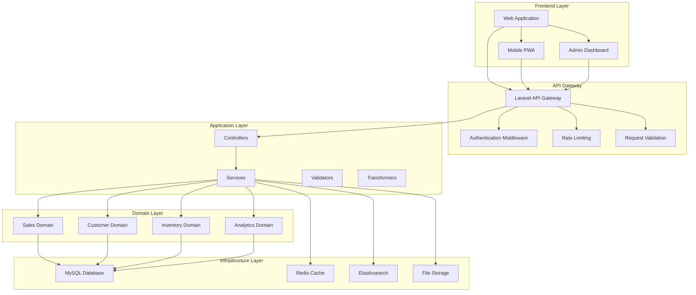
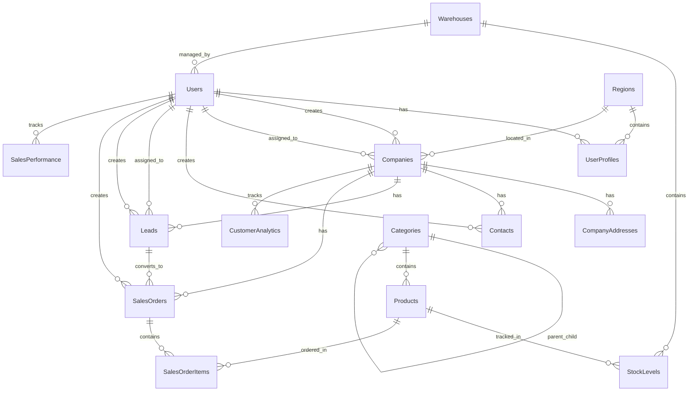

# Technical Specification: Advanced CRM for FMCG Industry

## Document Information
- **Version**: 1.0.0
- **Date**: October 30, 2025
- **Author**: Development Team
- **Framework**: Laravel 11.x
- **PHP Version**: 8.2+
- **Database**: MySQL 8.0+

---

## 1. Executive Summary

### 1.1 Project Overview
The Advanced CRM for FMCG (Fast-Moving Consumer Goods) is a comprehensive customer relationship management system specifically designed for the FMCG industry. This system will manage sales operations, customer relationships, inventory management, sales team performance, and provide advanced analytics for decision-making.

### 1.2 Business Objectives
- Streamline sales processes and improve customer engagement
- Provide real-time inventory tracking and management
- Enable data-driven decision making through advanced analytics
- Improve sales team productivity and performance tracking
- Integrate with existing POS systems for seamless operations
- Ensure compliance with industry regulations and data protection standards

### 1.3 Target Users
- Sales Representatives and Field Agents
- Sales Managers and Team Leaders
- Inventory Managers
- Marketing Teams
- Senior Management and Executives
- Distributors and Retailers

---

## 2. System Architecture

### 2.1 Technology Stack

#### Backend
- **Framework**: Laravel 11.x
- **PHP Version**: 8.2+
- **Database**: MySQL 8.0+
- **API**: RESTful API with JSON responses
- **Authentication**: Laravel Sanctum + JWT
- **Queue System**: Redis with Laravel Queues
- **Caching**: Redis
- **Search Engine**: Elasticsearch (optional for advanced search)

#### Frontend
- **Primary**: Laravel Blade with Tailwind CSS
- **Optional SPA Support**: Vue.js 3 / React 18
- **Mobile**: Progressive Web App (PWA) capabilities

#### Infrastructure
- **Web Server**: Nginx 1.20+
- **PHP-FPM**: PHP 8.2 FPM
- **Load Balancer**: Nginx / HAProxy
- **Containerization**: Docker + Docker Compose
- **Monitoring**: Laravel Telescope + Custom Dashboards

### 2.2 System Design Patterns

#### Architecture Pattern
- **Layered Architecture**: Controller → Service → Repository → Model
- **Domain-Driven Design (DDD)**: Bounded contexts for different business domains
- **CQRS (Command Query Responsibility Segregation)**: Separate read/write operations for complex queries
- **Event-Driven Architecture**: Laravel Events and Listeners for decoupled operations

#### Design Patterns
- **Repository Pattern**: Data access abstraction
- **Service Pattern**: Business logic encapsulation
- **Factory Pattern**: Object creation and initialization
- **Strategy Pattern**: Algorithm selection and variation
- **Observer Pattern**: Event handling and notifications

### 2.3 High-Level Architecture



---

## 3. Database Design

### 3.1 Database Schema Overview

#### Core Tables

##### Users & Authentication
```sql
-- Users table
CREATE TABLE users (
    id BIGINT UNSIGNED AUTO_INCREMENT PRIMARY KEY,
    name VARCHAR(255) NOT NULL,
    email VARCHAR(255) UNIQUE NOT NULL,
    email_verified_at TIMESTAMP NULL,
    password VARCHAR(255) NOT NULL,
    phone VARCHAR(20),
    avatar VARCHAR(255),
    role ENUM('super_admin', 'admin', 'sales_manager', 'sales_rep', 'inventory_manager', 'marketing') NOT NULL DEFAULT 'sales_rep',
    status ENUM('active', 'inactive', 'suspended') NOT NULL DEFAULT 'active',
    last_login_at TIMESTAMP NULL,
    created_at TIMESTAMP DEFAULT CURRENT_TIMESTAMP,
    updated_at TIMESTAMP DEFAULT CURRENT_TIMESTAMP ON UPDATE CURRENT_TIMESTAMP,
    deleted_at TIMESTAMP NULL
);

-- User profiles
CREATE TABLE user_profiles (
    id BIGINT UNSIGNED AUTO_INCREMENT PRIMARY KEY,
    user_id BIGINT UNSIGNED NOT NULL,
    employee_id VARCHAR(50) UNIQUE,
    department VARCHAR(100),
    position VARCHAR(100),
    manager_id BIGINT UNSIGNED NULL,
    region_id BIGINT UNSIGNED NULL,
    commission_rate DECIMAL(5,2) DEFAULT 0.00,
    target_sales DECIMAL(15,2) DEFAULT 0.00,
    bio TEXT,
    created_at TIMESTAMP DEFAULT CURRENT_TIMESTAMP,
    updated_at TIMESTAMP DEFAULT CURRENT_TIMESTAMP ON UPDATE CURRENT_TIMESTAMP,
    FOREIGN KEY (user_id) REFERENCES users(id) ON DELETE CASCADE,
    FOREIGN KEY (manager_id) REFERENCES users(id) ON DELETE SET NULL,
    FOREIGN KEY (region_id) REFERENCES regions(id) ON DELETE SET NULL
);
```

##### Customer Management
```sql
-- Companies/Customers
CREATE TABLE companies (
    id BIGINT UNSIGNED AUTO_INCREMENT PRIMARY KEY,
    name VARCHAR(255) NOT NULL,
    type ENUM('retailer', 'distributor', 'wholesaler', 'direct_customer') NOT NULL,
    tax_id VARCHAR(50),
    registration_number VARCHAR(50),
    industry VARCHAR(100),
    website VARCHAR(255),
    description TEXT,
    logo VARCHAR(255),
    status ENUM('prospect', 'active', 'inactive', 'blacklisted') NOT NULL DEFAULT 'prospect',
    credit_limit DECIMAL(15,2) DEFAULT 0.00,
    payment_terms VARCHAR(100),
    created_by BIGINT UNSIGNED NOT NULL,
    assigned_to BIGINT UNSIGNED NULL,
    created_at TIMESTAMP DEFAULT CURRENT_TIMESTAMP,
    updated_at TIMESTAMP DEFAULT CURRENT_TIMESTAMP ON UPDATE CURRENT_TIMESTAMP,
    deleted_at TIMESTAMP NULL,
    FOREIGN KEY (created_by) REFERENCES users(id),
    FOREIGN KEY (assigned_to) REFERENCES users(id) ON DELETE SET NULL
);

-- Company addresses
CREATE TABLE company_addresses (
    id BIGINT UNSIGNED AUTO_INCREMENT PRIMARY KEY,
    company_id BIGINT UNSIGNED NOT NULL,
    type ENUM('billing', 'shipping', 'headquarters', 'branch') NOT NULL,
    address_line_1 VARCHAR(255) NOT NULL,
    address_line_2 VARCHAR(255),
    city VARCHAR(100) NOT NULL,
    state VARCHAR(100),
    postal_code VARCHAR(20),
    country VARCHAR(100) NOT NULL,
    latitude DECIMAL(10,8),
    longitude DECIMAL(11,8),
    is_primary BOOLEAN DEFAULT FALSE,
    created_at TIMESTAMP DEFAULT CURRENT_TIMESTAMP,
    updated_at TIMESTAMP DEFAULT CURRENT_TIMESTAMP ON UPDATE CURRENT_TIMESTAMP,
    FOREIGN KEY (company_id) REFERENCES companies(id) ON DELETE CASCADE
);

-- Contacts
CREATE TABLE contacts (
    id BIGINT UNSIGNED AUTO_INCREMENT PRIMARY KEY,
    company_id BIGINT UNSIGNED NULL,
    first_name VARCHAR(100) NOT NULL,
    last_name VARCHAR(100) NOT NULL,
    email VARCHAR(255),
    phone VARCHAR(20),
    mobile VARCHAR(20),
    position VARCHAR(100),
    department VARCHAR(100),
    is_primary BOOLEAN DEFAULT FALSE,
    is_decision_maker BOOLEAN DEFAULT FALSE,
    date_of_birth DATE,
    notes TEXT,
    created_by BIGINT UNSIGNED NOT NULL,
    created_at TIMESTAMP DEFAULT CURRENT_TIMESTAMP,
    updated_at TIMESTAMP DEFAULT CURRENT_TIMESTAMP ON UPDATE CURRENT_TIMESTAMP,
    deleted_at TIMESTAMP NULL,
    FOREIGN KEY (company_id) REFERENCES companies(id) ON DELETE CASCADE,
    FOREIGN KEY (created_by) REFERENCES users(id),
    INDEX idx_contacts_company (company_id),
    INDEX idx_contacts_name (first_name, last_name)
);
```

##### Product & Inventory Management
```sql
-- Categories
CREATE TABLE categories (
    id BIGINT UNSIGNED AUTO_INCREMENT PRIMARY KEY,
    name VARCHAR(255) NOT NULL,
    slug VARCHAR(255) UNIQUE NOT NULL,
    description TEXT,
    parent_id BIGINT UNSIGNED NULL,
    image VARCHAR(255),
    sort_order INT DEFAULT 0,
    is_active BOOLEAN DEFAULT TRUE,
    created_at TIMESTAMP DEFAULT CURRENT_TIMESTAMP,
    updated_at TIMESTAMP DEFAULT CURRENT_TIMESTAMP ON UPDATE CURRENT_TIMESTAMP,
    FOREIGN KEY (parent_id) REFERENCES categories(id) ON DELETE SET NULL
);

-- Products
CREATE TABLE products (
    id BIGINT UNSIGNED AUTO_INCREMENT PRIMARY KEY,
    sku VARCHAR(100) UNIQUE NOT NULL,
    barcode VARCHAR(100) UNIQUE,
    name VARCHAR(255) NOT NULL,
    slug VARCHAR(255) UNIQUE NOT NULL,
    description TEXT,
    short_description VARCHAR(500),
    category_id BIGINT UNSIGNED NOT NULL,
    brand VARCHAR(100),
    unit VARCHAR(50) NOT NULL DEFAULT 'pcs',
    weight DECIMAL(10,3),
    dimensions VARCHAR(100),
    cost_price DECIMAL(10,2) NOT NULL,
    selling_price DECIMAL(10,2) NOT NULL,
    mrp DECIMAL(10,2),
    reorder_level INT DEFAULT 10,
    max_stock INT DEFAULT 1000,
    is_active BOOLEAN DEFAULT TRUE,
    is_featured BOOLEAN DEFAULT FALSE,
    image VARCHAR(255),
    created_at TIMESTAMP DEFAULT CURRENT_TIMESTAMP,
    updated_at TIMESTAMP DEFAULT CURRENT_TIMESTAMP ON UPDATE CURRENT_TIMESTAMP,
    deleted_at TIMESTAMP NULL,
    FOREIGN KEY (category_id) REFERENCES categories(id)
);

-- Inventory/Warehouses
CREATE TABLE warehouses (
    id BIGINT UNSIGNED AUTO_INCREMENT PRIMARY KEY,
    name VARCHAR(255) NOT NULL,
    code VARCHAR(50) UNIQUE NOT NULL,
    address TEXT,
    manager_id BIGINT UNSIGNED NULL,
    capacity DECIMAL(15,2),
    is_active BOOLEAN DEFAULT TRUE,
    created_at TIMESTAMP DEFAULT CURRENT_TIMESTAMP,
    updated_at TIMESTAMP DEFAULT CURRENT_TIMESTAMP ON UPDATE CURRENT_TIMESTAMP,
    FOREIGN KEY (manager_id) REFERENCES users(id) ON DELETE SET NULL
);

-- Stock Levels
CREATE TABLE stock_levels (
    id BIGINT UNSIGNED AUTO_INCREMENT PRIMARY KEY,
    product_id BIGINT UNSIGNED NOT NULL,
    warehouse_id BIGINT UNSIGNED NOT NULL,
    quantity INT NOT NULL DEFAULT 0,
    reserved_quantity INT NOT NULL DEFAULT 0,
    available_quantity INT GENERATED ALWAYS AS (quantity - reserved_quantity) STORED,
    last_updated TIMESTAMP DEFAULT CURRENT_TIMESTAMP ON UPDATE CURRENT_TIMESTAMP,
    FOREIGN KEY (product_id) REFERENCES products(id) ON DELETE CASCADE,
    FOREIGN KEY (warehouse_id) REFERENCES warehouses(id) ON DELETE CASCADE,
    UNIQUE KEY unique_product_warehouse (product_id, warehouse_id)
);
```

##### Sales Management
```sql
-- Leads/Opportunities
CREATE TABLE leads (
    id BIGINT UNSIGNED AUTO_INCREMENT PRIMARY KEY,
    title VARCHAR(255) NOT NULL,
    description TEXT,
    company_id BIGINT UNSIGNED NULL,
    contact_id BIGINT UNSIGNED NULL,
    source ENUM('website', 'referral', 'cold_call', 'email', 'social_media', 'trade_show', 'existing_customer', 'other') NOT NULL,
    status ENUM('new', 'contacted', 'qualified', 'proposal', 'negotiation', 'closed_won', 'closed_lost') NOT NULL DEFAULT 'new',
    priority ENUM('low', 'medium', 'high', 'urgent') NOT NULL DEFAULT 'medium',
    estimated_value DECIMAL(15,2),
    probability INT DEFAULT 0,
    expected_close_date DATE,
    assigned_to BIGINT UNSIGNED NOT NULL,
    created_by BIGINT UNSIGNED NOT NULL,
    closed_date DATE NULL,
    closed_reason TEXT NULL,
    created_at TIMESTAMP DEFAULT CURRENT_TIMESTAMP,
    updated_at TIMESTAMP DEFAULT CURRENT_TIMESTAMP ON UPDATE CURRENT_TIMESTAMP,
    deleted_at TIMESTAMP NULL,
    FOREIGN KEY (company_id) REFERENCES companies(id) ON DELETE SET NULL,
    FOREIGN KEY (contact_id) REFERENCES contacts(id) ON DELETE SET NULL,
    FOREIGN KEY (assigned_to) REFERENCES users(id),
    FOREIGN KEY (created_by) REFERENCES users(id)
);

-- Sales Orders
CREATE TABLE sales_orders (
    id BIGINT UNSIGNED AUTO_INCREMENT PRIMARY KEY,
    order_number VARCHAR(50) UNIQUE NOT NULL,
    company_id BIGINT UNSIGNED NOT NULL,
    contact_id BIGINT UNSIGNED NULL,
    lead_id BIGINT UNSIGNED NULL,
    order_date DATE NOT NULL,
    delivery_date DATE,
    status ENUM('draft', 'confirmed', 'processing', 'shipped', 'delivered', 'cancelled', 'returned') NOT NULL DEFAULT 'draft',
    subtotal DECIMAL(15,2) NOT NULL,
    tax_amount DECIMAL(15,2) DEFAULT 0.00,
    discount_amount DECIMAL(15,2) DEFAULT 0.00,
    total_amount DECIMAL(15,2) NOT NULL,
    payment_status ENUM('pending', 'paid', 'partially_paid', 'overdue', 'cancelled') NOT NULL DEFAULT 'pending',
    payment_method VARCHAR(100),
    delivery_address TEXT,
    notes TEXT,
    sales_rep_id BIGINT UNSIGNED NOT NULL,
    created_at TIMESTAMP DEFAULT CURRENT_TIMESTAMP,
    updated_at TIMESTAMP DEFAULT CURRENT_TIMESTAMP ON UPDATE CURRENT_TIMESTAMP,
    deleted_at TIMESTAMP NULL,
    FOREIGN KEY (company_id) REFERENCES companies(id),
    FOREIGN KEY (contact_id) REFERENCES contacts(id) ON DELETE SET NULL,
    FOREIGN KEY (lead_id) REFERENCES leads(id) ON DELETE SET NULL,
    FOREIGN KEY (sales_rep_id) REFERENCES users(id)
);

-- Sales Order Items
CREATE TABLE sales_order_items (
    id BIGINT UNSIGNED AUTO_INCREMENT PRIMARY KEY,
    sales_order_id BIGINT UNSIGNED NOT NULL,
    product_id BIGINT UNSIGNED NOT NULL,
    quantity INT NOT NULL,
    unit_price DECIMAL(10,2) NOT NULL,
    discount_percentage DECIMAL(5,2) DEFAULT 0.00,
    discount_amount DECIMAL(10,2) DEFAULT 0.00,
    tax_rate DECIMAL(5,2) DEFAULT 0.00,
    tax_amount DECIMAL(10,2) DEFAULT 0.00,
    total DECIMAL(15,2) NOT NULL,
    created_at TIMESTAMP DEFAULT CURRENT_TIMESTAMP,
    updated_at TIMESTAMP DEFAULT CURRENT_TIMESTAMP ON UPDATE CURRENT_TIMESTAMP,
    FOREIGN KEY (sales_order_id) REFERENCES sales_orders(id) ON DELETE CASCADE,
    FOREIGN KEY (product_id) REFERENCES products(id)
);
```

##### Analytics & Reporting
```sql
-- Sales Performance
CREATE TABLE sales_performance (
    id BIGINT UNSIGNED AUTO_INCREMENT PRIMARY KEY,
    user_id BIGINT UNSIGNED NOT NULL,
    period_type ENUM('daily', 'weekly', 'monthly', 'quarterly', 'yearly') NOT NULL,
    period_start DATE NOT NULL,
    period_end DATE NOT NULL,
    total_orders INT NOT NULL DEFAULT 0,
    total_revenue DECIMAL(15,2) NOT NULL DEFAULT 0.00,
    total_profit DECIMAL(15,2) NOT NULL DEFAULT 0.00,
    new_customers INT NOT NULL DEFAULT 0,
    target_revenue DECIMAL(15,2) DEFAULT 0.00,
    achievement_percentage DECIMAL(5,2) DEFAULT 0.00,
    created_at TIMESTAMP DEFAULT CURRENT_TIMESTAMP,
    updated_at TIMESTAMP DEFAULT CURRENT_TIMESTAMP ON UPDATE CURRENT_TIMESTAMP,
    FOREIGN KEY (user_id) REFERENCES users(id),
    UNIQUE KEY unique_user_period (user_id, period_type, period_start, period_end)
);

-- Customer Analytics
CREATE TABLE customer_analytics (
    id BIGINT UNSIGNED AUTO_INCREMENT PRIMARY KEY,
    company_id BIGINT UNSIGNED NOT NULL,
    period_type ENUM('monthly', 'quarterly', 'yearly') NOT NULL,
    period_start DATE NOT NULL,
    period_end DATE NOT NULL,
    total_orders INT NOT NULL DEFAULT 0,
    total_spent DECIMAL(15,2) NOT NULL DEFAULT 0.00,
    average_order_value DECIMAL(15,2) DEFAULT 0.00,
    last_order_date DATE NULL,
    loyalty_score INT DEFAULT 0,
    created_at TIMESTAMP DEFAULT CURRENT_TIMESTAMP,
    updated_at TIMESTAMP DEFAULT CURRENT_TIMESTAMP ON UPDATE CURRENT_TIMESTAMP,
    FOREIGN KEY (company_id) REFERENCES companies(id),
    UNIQUE KEY unique_company_period (company_id, period_type, period_start, period_end)
);
```

### 3.2 Database Relationships

#### Entity Relationship Diagram


### 3.3 Database Optimization

#### Indexing Strategy
- **Primary Keys**: All tables have auto-increment BIGINT primary keys
- **Foreign Keys**: Indexed for faster JOIN operations
- **Composite Indexes**: For frequently queried combinations
- **Full-text Search**: MySQL FULLTEXT indexes on product names and descriptions
- **Spatial Indexes**: For location-based queries

#### Partitioning
- **Sales Orders**: Partition by year for better performance
- **Analytics Tables**: Partition by period type
- **Audit Logs**: Partition by date

---

## 4. API Design

### 4.1 API Architecture

#### RESTful API Standards
- **Base URL**: `https://api.crm-fmcg.com/v1`
- **Content Type**: `application/json`
- **Authentication**: Bearer Token (JWT) + API Key for integrations
- **Rate Limiting**: 1000 requests per hour per user
- **Pagination**: Cursor-based for large datasets

#### Response Format
```json
{
    "success": true,
    "data": {},
    "message": "Operation completed successfully",
    "meta": {
        "timestamp": "2025-10-30T10:30:00Z",
        "request_id": "req_123456789",
        "version": "1.0.0"
    },
    "links": {
        "self": "https://api.crm-fmcg.com/v1/companies?page=1",
        "next": "https://api.crm-fmcg.com/v1/companies?page=2",
        "prev": null
    }
}
```

### 4.2 Core API Endpoints

#### Authentication Endpoints
```
POST   /auth/login
POST   /auth/logout
POST   /auth/refresh
POST   /auth/register
POST   /auth/forgot-password
POST   /auth/reset-password
GET    /auth/me
PUT    /auth/profile
POST   /auth/change-password
```

#### Company Management
```
GET    /companies
POST   /companies
GET    /companies/{id}
PUT    /companies/{id}
DELETE /companies/{id}
GET    /companies/{id}/contacts
GET    /companies/{id}/sales-orders
GET    /companies/{id}/analytics
POST   /companies/{id}/assign-user
```

#### Contact Management
```
GET    /contacts
POST   /contacts
GET    /contacts/{id}
PUT    /contacts/{id}
DELETE /contacts/{id}
GET    /contacts/search
POST   /contacts/{id}/notes
```

#### Product Management
```
GET    /products
POST   /products
GET    /products/{id}
PUT    /products/{id}
DELETE /products/{id}
GET    /products/search
GET    /products/{id}/stock-levels
PUT    /products/{id}/stock-levels
```

#### Sales Management
```
GET    /leads
POST   /leads
GET    /leads/{id}
PUT    /leads/{id}
DELETE /leads/{id}
POST   /leads/{id}/convert-to-order
PUT    /leads/{id}/status

GET    /sales-orders
POST   /sales-orders
GET    /sales-orders/{id}
PUT    /sales-orders/{id}
DELETE /sales-orders/{id}
POST   /sales-orders/{id}/items
PUT    /sales-orders/{id}/status
```

#### Analytics & Reporting
```
GET    /analytics/sales-performance
GET    /analytics/customer-analytics
GET    /analytics/product-performance
GET    /analytics/inventory-reports
GET    /analytics/sales-reports
GET    /analytics/dashboard-stats
```

### 4.3 API Validation & Security

#### Request Validation
- **Input Sanitization**: All inputs sanitized and validated
- **SQL Injection Protection**: Parameterized queries
- **XSS Protection**: Output encoding
- **CSRF Protection**: CSRF tokens for state-changing operations

#### Authentication & Authorization
- **JWT Tokens**: Stateless authentication with refresh tokens
- **Role-Based Access Control**: Permissions based on user roles
- **API Rate Limiting**: Prevent abuse and ensure fair usage
- **IP Whitelisting**: For sensitive operations

---

## 5. Core Features & Modules

### 5.1 User Management & Authentication

#### User Roles & Permissions
- **Super Admin**: Full system access
- **Admin**: Organization management
- **Sales Manager**: Team management and reporting
- **Sales Representative**: Customer and order management
- **Inventory Manager**: Stock and warehouse management
- **Marketing**: Campaign and lead management

#### Authentication Features
- **Multi-factor Authentication**: SMS/Email OTP
- **Single Sign-On (SSO)**: LDAP/SAML integration
- **Session Management**: Active session monitoring
- **Password Policies**: Complex password requirements
- **Account Lockout**: Brute force protection

### 5.2 Customer Relationship Management

#### Company Management
- **360° Customer View**: Complete customer profile
- **Hierarchy Management**: Parent-child company relationships
- **Credit Management**: Credit limits and payment terms
- **Document Management**: Contract and document storage
- **Communication History**: All interactions tracked

#### Contact Management
- **Contact Hierarchy**: Primary contacts and decision makers
- **Communication Preferences**: Email/phone preferences
- **Interaction Tracking**: Call logs and meeting notes
- **Birthday/Anniversary Reminders**: Automated notifications
- **Social Media Integration**: LinkedIn profiles

### 5.3 Sales Management

#### Lead Management
- **Lead Scoring**: Automatic lead qualification
- **Pipeline Management**: Visual sales pipeline
- **Activity Tracking**: Calls, emails, meetings
- **Lead Assignment**: Round-robin and territory-based
- **Conversion Tracking**: Lead-to-customer analytics

#### Order Management
- **Quote Generation**: Professional quote creation
- **Order Processing**: From quote to delivery
- **Inventory Check**: Real-time stock availability
- **Pricing Rules**: Tiered pricing and discounts
- **Order Tracking**: Delivery status updates

### 5.4 Inventory Management

#### Stock Management
- **Multi-warehouse Support**: Multiple location tracking
- **Real-time Updates**: Live stock levels
- **Low Stock Alerts**: Automated notifications
- **Stock Movements**: Complete audit trail
- **Batch/Expiry Tracking**: For perishable goods

#### Warehouse Management
- **Location Management**: Bin and rack tracking
- **Transfer Management**: Inter-warehouse transfers
- **Cycle Counting**: Regular stock verification
- **Reporting**: Warehouse performance metrics

### 5.5 Analytics & Reporting

#### Sales Analytics
- **Performance Dashboards**: Real-time KPI tracking
- **Sales Forecasting**: Predictive analytics
- **Territory Analysis: Regional performance
- **Product Performance**: Best/worst selling products
- **Customer Lifetime Value**: CLV calculations

#### Business Intelligence
- **Custom Reports**: Drag-and-drop report builder
- **Scheduled Reports**: Automated email delivery
- **Data Export**: Excel/CSV/PDF formats
- **Visual Analytics**: Charts and graphs
- **Mobile Dashboards**: On-the-go insights

---

## 6. Security Requirements

### 6.1 Application Security

#### Authentication Security
- **Password Hashing**: bcrypt with salt
- **Session Management**: Secure session handling
- **Token Security**: JWT with expiration
- **Multi-Factor Auth**: Optional 2FA
- **Login Attempt Limits**: Brute force protection

#### Data Protection
- **Encryption**: Data at rest and in transit
- **Sensitive Data**: PII encryption
- **Audit Logging**: Complete audit trail
- **Data Masking**: For non-production environments
- **Backup Security**: Encrypted backups

### 6.2 Infrastructure Security

#### Network Security
- **HTTPS**: TLS 1.3 encryption
- **Firewall**: Application-level firewalls
- **DDoS Protection**: Cloud-based protection
- **VPN Access**: Secure remote access
- **Network Segmentation**: Isolated environments

#### Server Security
- **Hardening**: OS and server hardening
- **Access Control**: Least privilege principle
- **Monitoring**: Security event monitoring
- **Patch Management**: Regular security updates
- **Vulnerability Scanning**: Regular security assessments

### 6.3 Compliance Requirements

#### Data Protection
- **GDPR Compliance**: EU data protection
- **CCPA Compliance**: California privacy laws
- **Data Retention**: Configurable retention policies
- **Right to Deletion**: Data removal capabilities
- **Consent Management**: Explicit consent tracking

#### Industry Compliance
- **PCI DSS**: Payment card security
- **ISO 27001**: Information security management
- **SOC 2**: Security controls attestation
- **HIPAA**: If handling health data

---

## 7. Performance & Scalability

### 7.1 Performance Requirements

#### Response Time Targets
- **API Response**: < 200ms for 95th percentile
- **Page Load**: < 2 seconds for all pages
- **Database Query**: < 100ms for optimized queries
- **File Upload**: < 5 seconds for 10MB files
- **Report Generation**: < 30 seconds for complex reports

#### Throughput Requirements
- **Concurrent Users**: 10,000 simultaneous users
- **API Requests**: 1,000 requests per second
- **Database Transactions**: 5,000 TPS
- **File Storage**: 1TB of files with 99.9% availability

### 7.2 Scalability Architecture

#### Horizontal Scaling
- **Load Balancing**: Multiple application servers
- **Database Sharding**: Horizontal data partitioning
- **Caching Layer**: Redis cluster for distributed caching
- **CDN Integration**: Static asset delivery
- **Microservices**: Modular service architecture

#### Database Optimization
- **Read Replicas**: Multiple read-only database copies
- **Connection Pooling**: Efficient database connections
- **Query Optimization**: Indexed and optimized queries
- **Caching Strategy**: Multi-level caching implementation
- **Database Monitoring**: Performance metrics tracking

### 7.3 Monitoring & Performance Tracking

#### Application Monitoring
- **APM Tools**: Application performance monitoring
- **Error Tracking**: Real-time error reporting
- **Performance Metrics**: Custom KPI tracking
- **User Analytics**: Usage pattern analysis
- **Resource Monitoring**: CPU, memory, disk usage

#### Infrastructure Monitoring
- **Server Health**: System resource monitoring
- **Network Performance**: Bandwidth and latency tracking
- **Database Performance**: Query performance analysis
- **Cache Performance**: Hit ratio and response times
- **Uptime Monitoring**: Service availability tracking

---

## 8. Integration Requirements

### 8.1 Third-Party Integrations

#### Payment Gateways
- **Stripe**: Credit card processing
- **PayPal**: Alternative payment method
- **Bank Transfers**: ACH and wire transfers
- **Mobile Payments**: Apple Pay, Google Pay
- **Regional Payment**: Local payment methods

#### Communication Channels
- **Email Services**: SMTP, SendGrid, Mailgun
- **SMS Services**: Twilio, Vonage
- **WhatsApp Business**: Customer messaging
- **Social Media**: Facebook, LinkedIn integration
- **Video Conferencing**: Zoom, Teams integration

#### Shipping & Logistics
- **Shipping Carriers**: FedEx, UPS, DHL
- **Tracking Integration**: Real-time shipment tracking
- **Route Optimization**: Delivery route planning
- **Warehouse Integration**: WMS systems
- **Inventory Sync**: Real-time inventory updates

### 8.2 API Integrations

#### External Systems
- **Accounting Software**: QuickBooks, Xero
- **ERP Systems**: SAP, Oracle NetSuite
- **CRM Systems**: Salesforce, HubSpot migration
- **Marketing Automation**: Mailchimp, Marketo
- **E-commerce Platforms**: Shopify, WooCommerce

#### Data Synchronization
- **Real-time Sync**: Webhook-based updates
- **Batch Processing**: Scheduled data imports
- **Data Mapping**: Field mapping and transformation
- **Conflict Resolution**: Data conflict handling
- **Audit Trail**: Integration activity logging

---

## 9. Mobile & Offline Capabilities

### 9.1 Mobile Application

#### Progressive Web App (PWA)
- **Offline Support**: Cached data and offline functionality
- **Push Notifications**: Real-time alerts and updates
- **Device Integration**: Camera, GPS, contacts
- **Responsive Design**: Optimized for all screen sizes
- **App-like Experience**: Native app feel in browser

#### Native Mobile Apps (Future)
- **iOS App**: Native iPhone/iPad application
- **Android App**: Native Android application
- **Cross-platform**: React Native or Flutter
- **Offline Mode**: Local data storage
- **Sync Capabilities**: Background data synchronization

### 9.2 Offline Functionality

#### Data Management
- **Local Storage**: IndexedDB for offline data
- **Sync Queue**: Offline changes queued for sync
- **Conflict Resolution**: Automatic conflict handling
- **Data Validation**: Client-side validation
- **Progressive Loading**: Optimized data loading

#### Features Available Offline
- **Customer Viewing**: Cached customer information
- **Order Creation**: Draft orders saved locally
- **Inventory Check**: Last known stock levels
- **Task Management**: Offline task creation
- **Note Taking**: Local note storage

---

## 10. Testing Strategy

### 10.1 Testing Framework

#### Automated Testing
- **Unit Tests**: PHPUnit for backend logic
- **Integration Tests**: API endpoint testing
- **Browser Tests**: Laravel Dusk for UI testing
- **Performance Tests**: Load and stress testing
- **Security Tests**: Vulnerability scanning

#### Manual Testing
- **User Acceptance Testing**: End-user validation
- **Exploratory Testing**: Ad-hoc testing scenarios
- **Compatibility Testing**: Cross-browser and device testing
- **Accessibility Testing**: WCAG compliance
- **Usability Testing**: User experience evaluation

### 10.2 Test Coverage Requirements

#### Code Coverage Targets
- **Unit Test Coverage**: > 90% code coverage
- **Integration Coverage**: > 80% API coverage
- **UI Test Coverage**: > 70% user flows covered
- **Critical Path Coverage**: 100% business-critical functions
- **Security Test Coverage**: All security features tested

#### Test Environment
- **Development Environment**: Local testing setup
- **Staging Environment**: Production-like testing
- **Performance Environment**: Load testing infrastructure
- **Security Environment**: Isolated security testing
- **UAT Environment**: User acceptance testing

---

## 11. Deployment & Infrastructure

### 11.1 Deployment Architecture

#### Cloud Infrastructure
- **Cloud Provider**: AWS, Azure, or GCP
- **Application Servers**: Auto-scaling groups
- **Database**: Managed MySQL service
- **Cache**: Redis cluster
- **Storage**: Object storage for files

#### Container Strategy
- **Docker**: Application containerization
- **Kubernetes**: Container orchestration
- **Docker Compose**: Local development
- **CI/CD Pipeline**: Automated deployment
- **Rollback Strategy**: Blue-green deployment

### 11.2 Infrastructure Components

#### Web Servers
- **Nginx**: Reverse proxy and load balancing
- **SSL Termination**: HTTPS handling
- **Static File Serving**: Optimized asset delivery
- **Compression**: Gzip compression
- **Caching**: Browser caching headers

#### Database Infrastructure
- **Primary Database**: Write operations
- **Read Replicas**: Read operations scaling
- **Backup Strategy**: Automated backups
- **Disaster Recovery**: Multi-region setup
- **Monitoring**: Database performance monitoring

### 11.3 Monitoring & Logging

#### Application Monitoring
- **Laravel Telescope**: Application monitoring
- **Custom Dashboards**: Business metrics tracking
- **Error Tracking**: Real-time error reporting
- **Performance Monitoring**: Response time tracking
- **User Analytics**: Usage pattern analysis

#### Infrastructure Monitoring
- **Server Metrics**: CPU, memory, disk usage
- **Network Monitoring**: Bandwidth and latency
- **Database Monitoring**: Query performance
- **Application Logs**: Centralized logging
- **Alert System**: Proactive issue detection

---

## 12. Project Timeline & Milestones

### 12.1 Development Phases

#### Phase 1: Foundation (Weeks 1-4)
- **Project Setup**: Laravel installation and configuration
- **Database Design**: Schema creation and migrations
- **Authentication**: User management system
- **Basic UI**: Core interface components
- **API Foundation**: RESTful API structure

#### Phase 2: Core Features (Weeks 5-8)
- **Customer Management**: Company and contact management
- **Product Management**: Product catalog and categories
- **Inventory Management**: Stock level tracking
- **Sales Management**: Lead and order management
- **Basic Reports**: Standard reporting features

#### Phase 3: Advanced Features (Weeks 9-12)
- **Analytics Dashboard**: Advanced analytics and reporting
- **Mobile PWA**: Progressive web app functionality
- **Integrations**: Third-party system integrations
- **Advanced Security**: Enhanced security features
- **Performance Optimization**: Caching and optimization

#### Phase 4: Testing & Deployment (Weeks 13-16)
- **Testing**: Comprehensive testing phase
- **Documentation**: Technical and user documentation
- **Training**: User training materials
- **Deployment**: Production deployment
- **Launch**: Go-live and post-launch support

### 12.2 Key Milestones

#### Technical Milestones
- **MVP Release**: Core functionality working
- **Beta Launch**: Limited user testing
- **Feature Complete**: All planned features implemented
- **Security Audit**: Security review completed
- **Performance Testing**: Load testing completed

#### Business Milestones
- **User Acceptance**: Stakeholder approval
- **Training Completion**: User training delivered
- **Go-live Decision**: Final launch approval
- **Post-launch Review**: 30-day review
- **Optimization Phase**: Performance optimization

---

## 13. Risk Management

### 13.1 Technical Risks

#### Development Risks
- **Technology Complexity**: New technology learning curve
- **Integration Challenges**: Third-party system integration
- **Performance Issues**: Scalability and performance bottlenecks
- **Security Vulnerabilities**: Security implementation gaps
- **Data Migration**: Legacy data transfer challenges

#### Mitigation Strategies
- **Proof of Concepts**: Technical feasibility validation
- **Incremental Development**: Agile development approach
- **Regular Testing**: Continuous testing and validation
- **Security Reviews**: Regular security assessments
- **Backup Plans**: Alternative technology options

### 13.2 Business Risks

#### Project Risks
- **Scope Creep**: Feature expansion beyond budget
- **Timeline Delays**: Project timeline extensions
- **Budget Overruns**: Cost exceeding estimates
- **User Adoption**: Low user acceptance
- **Competitive Pressure**: Market timing issues

#### Mitigation Strategies
- **Clear Requirements**: Detailed requirement documentation
- **Regular Reviews**: Weekly progress reviews
- **Budget Monitoring**: Continuous cost tracking
- **User Involvement**: Early user engagement
- **Market Research**: Competitive analysis

---

## 14. Maintenance & Support

### 14.1 Support Strategy

#### Technical Support
- **Help Desk**: 24/7 technical support
- **Knowledge Base**: Self-service documentation
- **Community Forum**: User community support
- **Premium Support**: Priority support packages
- **Emergency Support**: Critical issue resolution

#### Maintenance Activities
- **Regular Updates**: Monthly security patches
- **Performance Tuning**: Ongoing optimization
- **Backup Management**: Automated backup processes
- **Security Audits**: Quarterly security reviews
- **Feature Enhancements**: Continuous improvement

### 14.2 Documentation

#### Technical Documentation
- **API Documentation**: Complete API reference
- **Database Schema**: Database design documentation
- **Deployment Guide**: Production deployment instructions
- **Troubleshooting Guide**: Common issue resolution
- **Development Guide**: Custom development instructions

#### User Documentation
- **User Manual**: Complete user guide
- **Quick Start Guide**: Getting started instructions
- **Video Tutorials**: Video-based training
- **FAQ**: Frequently asked questions
- **Best Practices**: Usage recommendations

---

## 15. Conclusion

### 15.1 Project Summary
The Advanced CRM for FMCG system represents a comprehensive solution designed specifically for the FMCG industry's unique needs. By leveraging modern technologies like PHP 8.2, Laravel 11.x, and MySQL 8.0+, the system will provide robust functionality, excellent performance, and future scalability.

### 15.2 Key Success Factors
- **User-Centric Design**: Focus on user experience and productivity
- **Scalable Architecture**: Built to grow with the business
- **Security First**: Comprehensive security implementation
- **Performance Optimized**: Fast and responsive user experience
- **Integration Ready**: Easy integration with existing systems

### 15.3 Next Steps
1. **Project Kickoff**: Initiate development team formation
2. **Environment Setup**: Development and testing environments
3. **Detailed Planning**: Sprint planning and task breakdown
4. **Development Start**: Begin Phase 1 development activities
5. **Regular Monitoring**: Continuous progress tracking and reporting

---

## Appendices

### Appendix A: Technology Stack Details
- **Laravel 11.x**: Latest Laravel framework features
- **PHP 8.2+**: Modern PHP features and performance
- **MySQL 8.0+**: Advanced database features
- **Redis**: High-performance caching
- **Nginx**: Web server and reverse proxy
- **Docker**: Containerization platform

### Appendix B: Sample Database Schema
[Complete SQL schema files would be included here]

### Appendix C: API Documentation Examples
[Sample API documentation would be included here]

### Appendix D: Security Checklist
[Detailed security requirements and checklist]

### Appendix E: Performance Benchmarks
[Expected performance metrics and benchmarks]

---

**Document Version**: 1.0.0
**Last Updated**: October 30, 2025
**Next Review**: January 30, 2026