# CODESPACE Detailed User Flows and Process Maps

## 1. Overview

This document contains comprehensive flowcharts and process maps for all major user interactions with the CODESPACE CLI tool. Each flow includes decision points, user inputs, system validations, file operations, and success/error states.

## 2. Main Initialization Flow (`codespace init`)

### 2.1 High-Level Flowchart
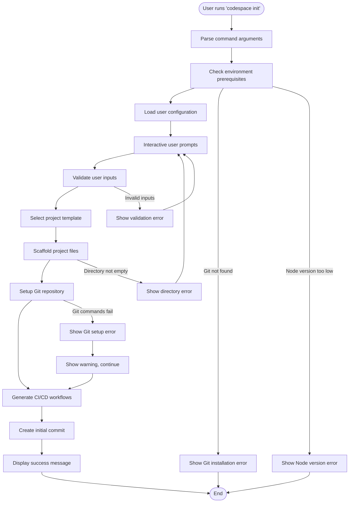

### 2.2 Detailed Initialization Process
```mermaid
flowchart TD
    Start([User runs: codespace init]) --> A1[Parse command line options]
    A1 --> A2{Options provided?}
    A2 -->|Yes| A3[Extract template, name, etc.]
    A2 -->|No| A4[Use default configuration]

    A3 --> B1[Check system requirements]
    A4 --> B1
    B1 --> B2{Node.js >= 14?}
    B2 -->|No| B3[Show Node.js version error]
    B2 -->|Yes| B4{Git installed?}

    B3 --> EndError([Exit with error])
    B4 -->|No| B5[Show Git installation error]
    B4 -->|Yes| C1[Load user configuration]

    B5 --> EndError
    C1 --> C2{Config file exists?}
    C2 -->|No| C3[Create default config]
    C2 -->|Yes| C4[Parse existing config]

    C3 --> D1[Start interactive prompts]
    C4 --> D1
    D1 --> D2[Project name prompt]
    D2 --> D3{Valid name?}
    D3 -->|No| D4[Show validation error]
    D3 -->|Yes| D5[Project description prompt]

    D4 --> D2
    D5 --> D6[Author name prompt]
    D6 --> D7[Email prompt]
    D7 --> D8[License selection]
    D8 --> D9[Language/framework selection]
    D9 --> D10[Additional options prompts]

    D10 --> E1[Validate target directory]
    E1 --> E2{Directory exists?}
    E2 -->|Yes| E3{Directory empty?}
    E2 -->|No| E4[Create directory]

    E3 -->|No| E5[Prompt for overwrite]
    E3 -->|Yes| F1[Load selected template]
    E4 --> F1
    E5 --> E6{User confirms?}

    E6 -->|No| E7[Choose new directory name]
    E6 -->|Yes| F2[Clear directory contents]
    E7 --> E1

    F2 --> F1
    F1 --> F2[F1: Validate template]
    F2 --> F3{Template valid?}
    F3 -->|No| F4[Show template error]
    F3 -->|Yes| G1[Create directory structure]

    F4 --> D9
    G1 --> G2[Generate template files]
    G2 --> G3{All files generated?}
    G3 -->|No| G4[Show file generation error]
    G3 -->|Yes| H1[Create .gitignore]

    G4 --> EndError
    H1 --> H2[Initialize Git repository]
    H2 --> H3{Git init success?}
    H3 -->|No| H4[Show Git warning]
    H3 -->|Yes| I1[Generate GitHub Actions workflow]

    H4 --> I1
    I1 --> I2{CI/CD enabled?}
    I2 -->|No| J1[Stage all files]
    I2 -->|Yes| I3[Create .github/workflows/]

    I3 --> I4[Generate ci.yml file]
    I4 --> I5{Workflow generated?}
    I5 -->|No| I6[Show CI warning]
    I5 -->|Yes| J1

    I6 --> J1
    J1 --> J2[Create initial commit]
    J2 --> J3{Commit successful?}
    J3 -->|No| J4[Show commit warning]
    J3 -->|Yes| K1[Display success summary]

    J4 --> K1
    K1 --> K2[Show next steps]
    K2 --> EndSuccess([Exit successfully])
```

## 3. Snippet Management Flows

### 3.1 Add Snippet Flow
```mermaid
flowchart TD
    Start([User runs: codespace snippet add]) --> A1[Prompt for snippet name]
    A1 --> A2{Name provided?}
    A2 -->|No| A3[Show name required error]
    A2 -->|Yes| A4{Name already exists?]

    A3 --> A1
    A4 -->|Yes| A5[Prompt for overwrite]
    A4 -->|No| B1[Prompt for description]

    A5 --> A6{User confirms?}
    A6 -->|No| A1
    A6 -->|Yes| B1

    B1 --> B2[Prompt for language]
    B2 --> B3[Show language options]
    B3 --> B4{Language selected?}
    B4 -->|No| B2
    B4 -->|Yes| C1[Prompt for framework]

    C1 --> C2[Show framework options]
    C2 --> C3{Framework selected?}
    C3 -->|No| C1
    C3 -->|Yes| D1[Prompt for tags]

    D1 --> D2[Collect tags input]
    D2 --> D3[Parse tags]
    D3 --> E1[Start code input mode]
    E1 --> E2[Display "Enter code (Ctrl+D to finish)"]
    E2 --> E3[Read code from stdin]
    E3 --> E4{End of input?}
    E4 -->|No| E3
    E4 -->|Yes| F1[Validate snippet syntax]

    F1 --> F2{Syntax valid?}
    F2 -->|No| F3[Show syntax error]
    F2 -->|Yes| G1[Create snippet object]

    F3 --> E1
    G1 --> G2[Add metadata (timestamp, usage count)]
    G2 --> H1[Save snippet to storage]
    H1 --> H2{Save successful?}
    H2 -->|No| H3[Show save error]
    H2 -->|Yes| I1[Update snippets index]

    H3 --> EndError([Exit with error])
    I1 --> I2{Index updated?}
    I2 -->|No| I3[Show index warning]
    I2 -->|Yes| J1[Display success message]

    I3 --> J1
    J1 --> EndSuccess([Exit successfully])
```

### 3.2 List Snippets Flow
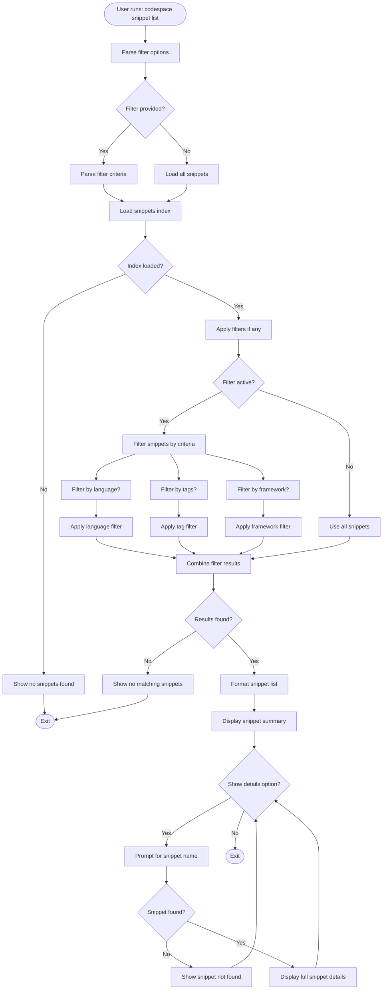

### 3.3 Remove Snippet Flow
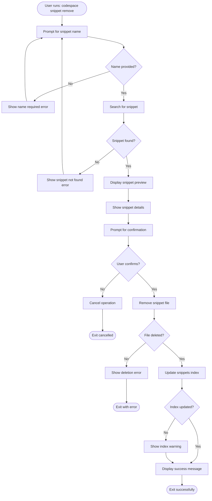

## 4. Template Selection and Customization Flow

### 4.1 Template Selection Process
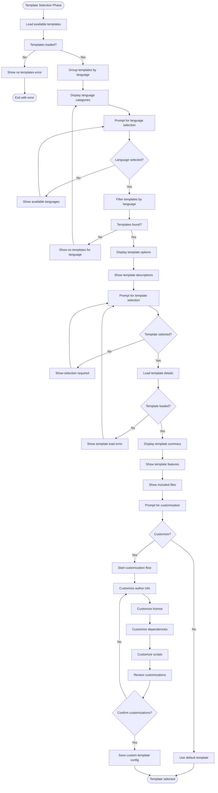

### 4.2 Template Customization Flow
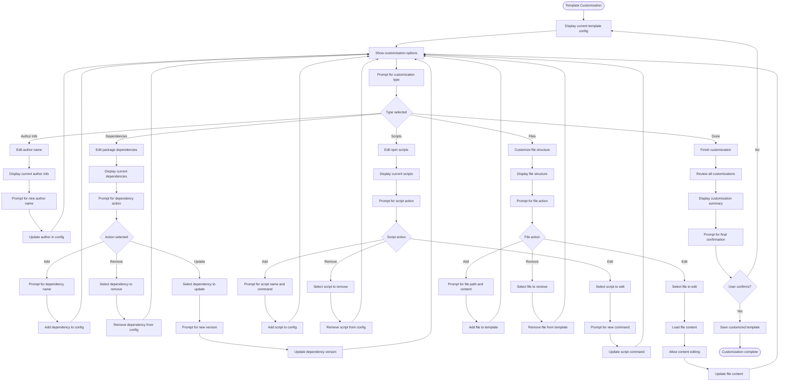

## 5. Error Handling and Recovery Flows

### 5.1 General Error Handling Flow
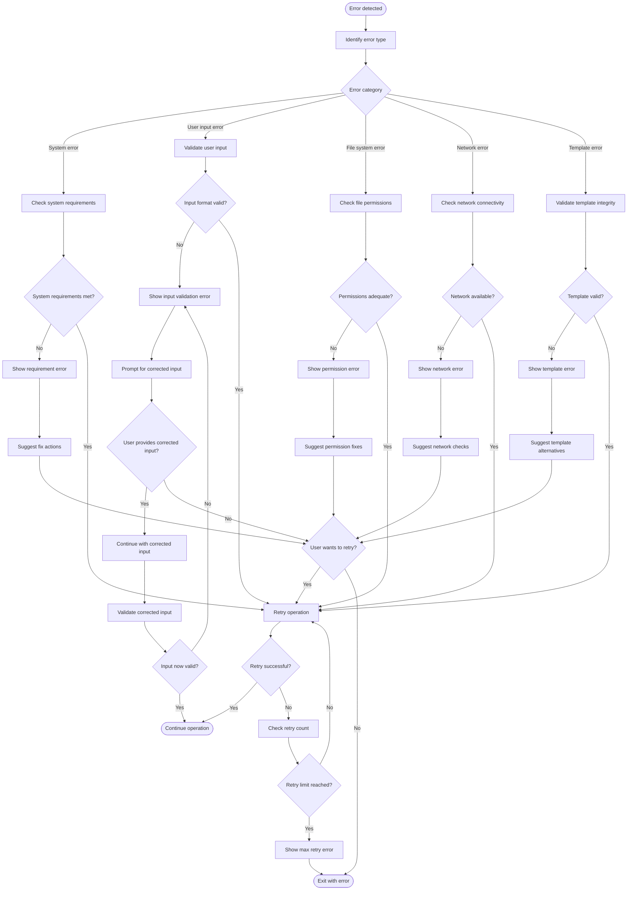

### 5.2 File System Error Recovery
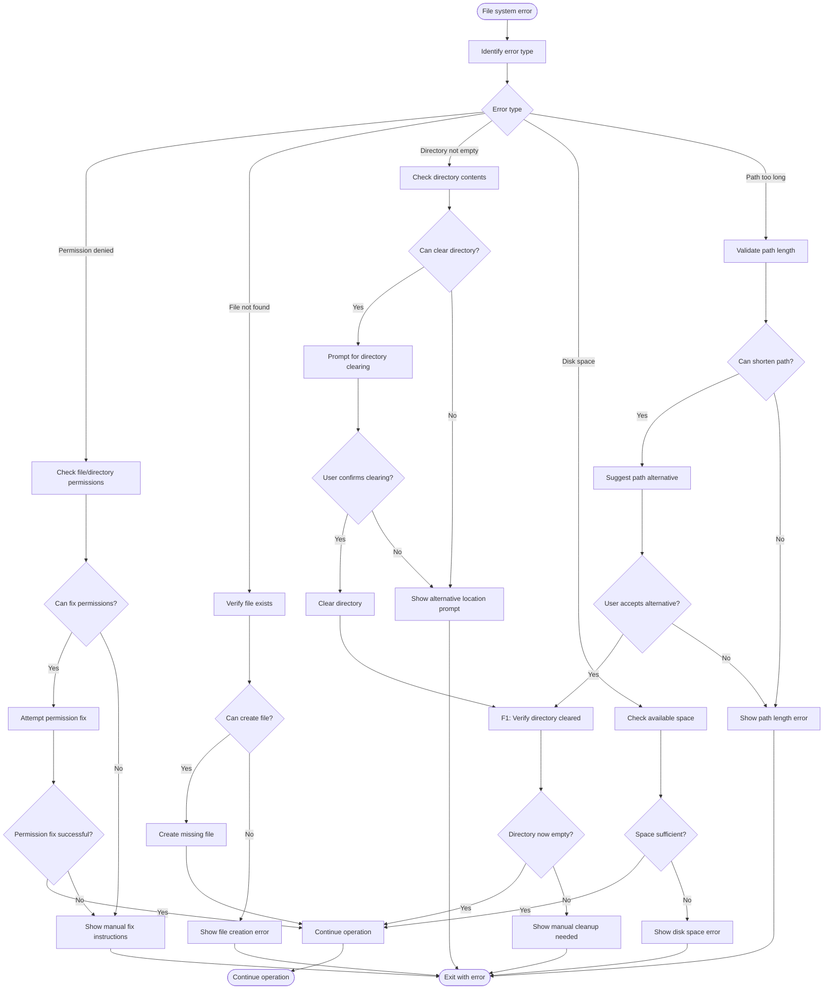

## 6. Configuration and Preference Management Flows

### 6.1 Configuration Loading Flow
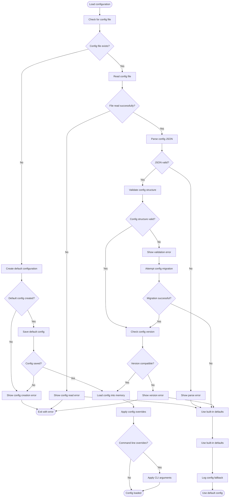

### 6.2 Configuration Update Flow
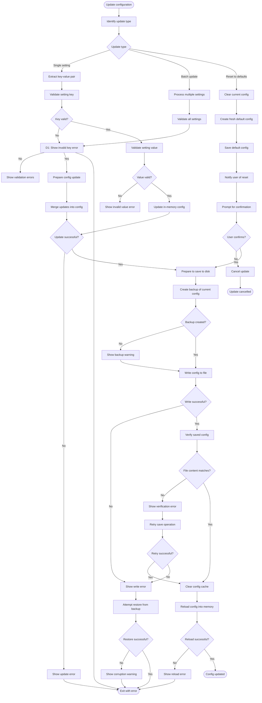

## 7. Integration and External Service Flows

### 7.1 Git Integration Flow
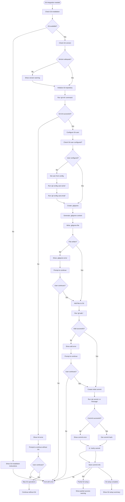

### 7.2 CI/CD Workflow Generation Flow
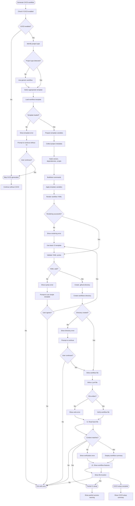

## 8. Summary

This comprehensive flow documentation covers all major user interactions with the CODESPACE CLI tool:

1. **Main initialization flow** - Complete project scaffolding process
2. **Snippet management flows** - Add, list, and remove operations
3. **Template selection and customization** - Interactive template workflows
4. **Error handling and recovery** - Robust error management
5. **Configuration management** - Settings and preferences
6. **External integrations** - Git and CI/CD setup

Each flow includes:
- Decision points and user interactions
- Validation steps and error conditions
- Success and error states with appropriate handling
- Recovery mechanisms and retry logic
- Alternative paths and edge cases

These flowcharts serve as the foundation for implementing a robust, user-friendly CLI tool that handles all scenarios gracefully.