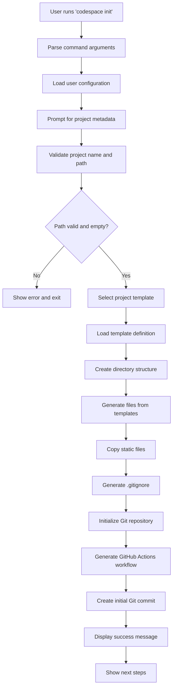
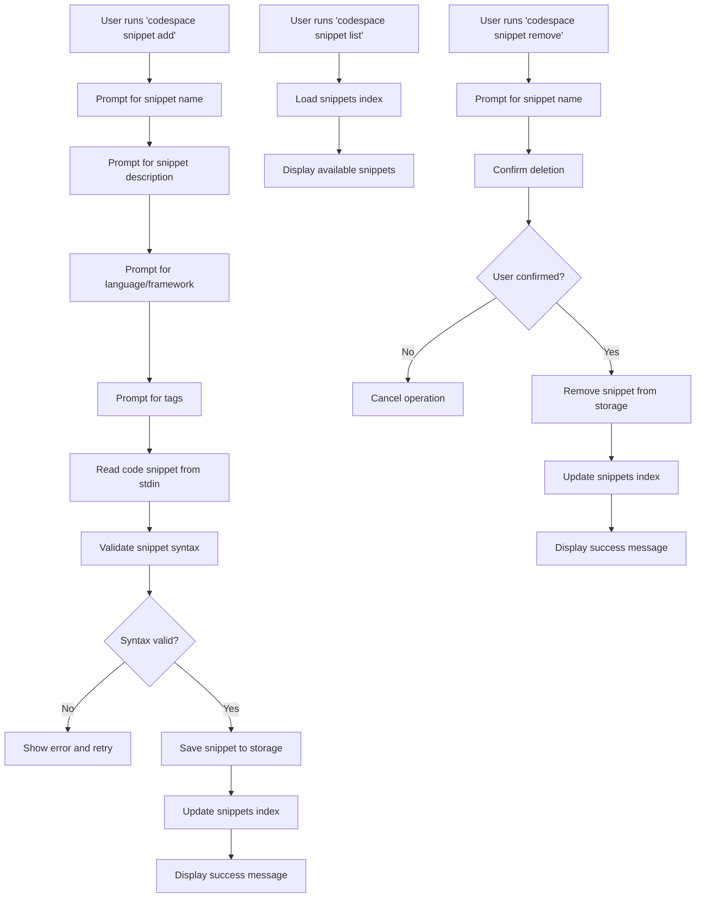
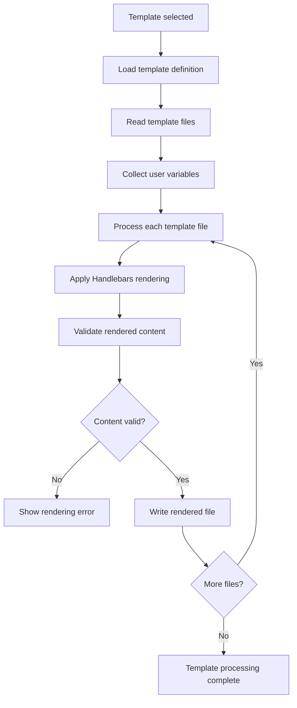

# CODESPACE System Architecture and Modules Documentation

## 1. Executive Summary

CODESPACE is a CLI tool designed to scaffold new software projects with consistent structure and best practices. This document outlines the complete system architecture, core modules, data flows, and technical relationships.

## 2. Core System Architecture

### 2.1 High-Level Architecture
```
┌─────────────────────────────────────────────────────────────┐
│                    CODESPACE CLI TOOL                       │
├─────────────────────────────────────────────────────────────┤
│  CLI Interface Layer (Commander.js + Inquirer.js)           │
├─────────────────────────────────────────────────────────────┤
│  Service Layer                                              │
│  ├── Template Engine Service                                │
│  ├── Project Scaffolding Service                            │
│  ├── Git Integration Service                                │
│  ├── CI/CD Service                                          │
│  ├── Snippet Management Service                             │
│  └── Configuration Service                                  │
├─────────────────────────────────────────────────────────────┤
│  Data Layer                                                 │
│  ├── Local Templates (.codespace/templates/)               │
│  ├── Snippets Storage (.codespace/snippets/)               │
│  ├── User Configuration (.codespace/config/)               │
│  └── Cache (.codespace/cache/)                             │
├─────────────────────────────────────────────────────────────┤
│  External Integrations                                      │
│  ├── Git Commands                                           │
│  ├── File System Operations                                 │
│  └── Package Managers (npm, pip, maven, go mod)            │
└─────────────────────────────────────────────────────────────┘
```

## 3. Core Modules

### 3.1 CLI Interface Module
**Purpose**: Handle command parsing, user prompts, and output formatting

**Key Functions**:
- `init()` - Main project initialization command
- `snippet_add()` - Add new code snippet
- `snippet_list()` - List available snippets
- `snippet_remove()` - Remove snippet
- `config_set()` - Set configuration value
- `config_get()` - Get configuration value
- `help()` - Display help information

**Inputs**: Command-line arguments, user responses to prompts
**Outputs**: Formatted console output, command execution results

**Dependencies**: Commander.js, Inquirer.js, Chalk

### 3.2 Template Engine Module
**Purpose**: Process templates and generate files with variable substitution

**Key Functions**:
- `load_template(template_id)` - Load template from storage
- `render_template(template, variables)` - Apply Handlebars rendering
- `validate_template(template)` - Validate template syntax
- `get_available_templates()` - List all available templates

**Inputs**: Template ID, user variables (project name, description, etc.)
**Outputs**: Rendered file content

**Dependencies**: Handlebars.js, File system operations

### 3.3 Project Scaffolding Module
**Purpose**: Create directory structure and copy/generate files

**Key Functions**:
- `create_directory_structure(structure)` - Create folder hierarchy
- `generate_files(template_files, variables)` - Generate project files
- `copy_static_files(files)` - Copy static assets
- `validate_project_path(path)` - Check if path is valid for scaffolding

**Inputs**: Directory structure definition, file templates, project metadata
**Outputs**: Complete project directory with all files

**Dependencies**: File system module, Template Engine

### 3.4 Git Integration Module
**Purpose**: Handle Git repository operations

**Key Functions**:
- `init_repository(path)` - Run git init
- `create_gitignore(template)` - Generate .gitignore file
- `add_files(files)` - Stage files for commit
- `create_commit(message)` - Create initial commit
- `check_git_installation()` - Verify Git is available

**Inputs**: Repository path, files to stage, commit message
**Outputs**: Git repository with initial commit

**Dependencies**: Child process (git commands), File system

### 3.5 CI/CD Module
**Purpose**: Generate GitHub Actions workflows

**Key Functions**:
- `generate_ci_workflow(project_type, options)` - Create GitHub Actions file
- `get_workflow_template(language)` - Get appropriate CI template
- `validate_workflow_syntax(workflow)` - Validate YAML syntax

**Inputs**: Project language/framework, CI preferences
**Outputs**: `.github/workflows/ci.yml` file

**Dependencies**: YAML handling, Template Engine

### 3.6 Snippet Management Module
**Purpose**: Manage local code snippets library

**Key Functions**:
- `add_snippet(name, code, metadata)` - Store new snippet
- `list_snippets(filter)` - List available snippets
- `remove_snippet(name)` - Delete snippet
- `search_snippets(query)` - Search snippets by tags/content
- `get_snippet(name)` - Retrieve specific snippet

**Inputs**: Snippet data, search queries
**Outputs**: Snippet operations results

**Dependencies**: JSON/YAML file handling, File system

### 3.7 Configuration Module
**Purpose**: Manage user preferences and settings

**Key Functions**:
- `load_config()` - Load user configuration
- `save_config(config)` - Save configuration changes
- `get_setting(key)` - Get specific setting
- `set_setting(key, value)` - Update setting
- `validate_config(config)` - Validate configuration format

**Inputs**: Configuration data, setting keys/values
**Outputs**: Configuration operations results

**Dependencies**: JSON file handling, File system

## 4. Data Models and Storage Schema

### 4.1 Directory Structure
```
.codespace/
├── templates/
│   ├── nodejs/
│   │   ├── package.json.hbs
│   │   ├── src/
│   │   │   └── index.js.hbs
│   │   └── README.md.hbs
│   ├── python/
│   ├── java/
│   ├── go/
│   └── template_registry.json
├── snippets/
│   ├── http_endpoint.json
│   ├── auth_handler.json
│   └── snippets_index.json
├── config/
│   └── user_config.json
└── cache/
    └── template_cache.json
```

### 4.2 Template Schema
```json
{
  "template_registry": {
    "templates": [
      {
        "id": "nodejs-express",
        "name": "Node.js Express",
        "description": "Express.js web application template",
        "language": "javascript",
        "framework": "express",
        "version": "1.0.0",
        "files": [
          {
            "path": "package.json.hbs",
            "type": "template",
            "target": "package.json"
          },
          {
            "path": "src/index.js.hbs",
            "type": "template",
            "target": "src/index.js"
          }
        ],
        "directories": ["src", "tests", "docs"],
        "dependencies": ["express", "cors", "helmet"],
        "dev_dependencies": ["nodemon", "jest"],
        "scripts": {
          "start": "node src/index.js",
          "dev": "nodemon src/index.js",
          "test": "jest"
        }
      }
    ]
  }
}
```

### 4.3 Snippet Schema
```json
{
  "snippets_index": {
    "snippets": [
      {
        "id": "http_endpoint",
        "name": "HTTP Endpoint",
        "description": "Basic HTTP endpoint with error handling",
        "language": "javascript",
        "framework": "express",
        "tags": ["api", "endpoint", "express"],
        "code": "app.get('/api/endpoint', (req, res) => {\n  try {\n    // Your logic here\n    res.json({ success: true });\n  } catch (error) {\n    res.status(500).json({ error: error.message });\n  }\n});",
        "created_at": "2024-01-01T00:00:00Z",
        "usage_count": 0
      }
    ]
  }
}
```

### 4.4 User Configuration Schema
```json
{
  "user_config": {
    "version": "1.0.0",
    "defaults": {
      "author": "Your Name",
      "email": "your.email@example.com",
      "license": "MIT",
      "include_docs": true,
      "include_ci": true,
      "git_init": true
    },
    "preferences": {
      "template_directory": "~/.codespace/templates",
      "snippet_directory": "~/.codespace/snippets",
      "default_language": "javascript",
      "output_style": "colorful"
    },
    "recent_projects": [
      {
        "name": "my-project",
        "path": "/path/to/my-project",
        "template": "nodejs-express",
        "created_at": "2024-01-01T00:00:00Z"
      }
    ]
  }
}
```

## 5. User Flow Diagrams

### 5.1 Main Initialization Flow


### 5.2 Snippet Management Flow


### 5.3 Template Processing Flow


## 6. Module Interactions and Dependencies

### 6.1 Dependency Graph
```
CLI Interface Module
├── Configuration Module (loads user defaults)
├── Template Engine Module (processes templates)
├── Project Scaffolding Module (creates project)
│   ├── Template Engine Module (renders files)
│   └── Git Integration Module (initializes repo)
│       └── File System Operations
├── CI/CD Module (generates workflows)
│   └── Template Engine Module
├── Snippet Management Module
│   └── Configuration Module (for storage path)
└── Configuration Module
    └── File System Operations
```

### 6.2 Data Flow Between Modules
1. **CLI Interface** receives user input and loads configuration
2. **Configuration Module** provides defaults and preferences
3. **Template Engine** loads and processes selected templates
4. **Project Scaffolding** coordinates file generation and directory creation
5. **Git Integration** handles version control setup
6. **CI/CD Module** generates workflow files
7. **All modules** use the **Configuration Module** for settings and paths

## 7. API Interfaces and Function Contracts

### 7.1 CLI Interface Module APIs
```javascript
// Command handlers
async function init(options) {
  // Returns: { success: boolean, projectPath: string, message: string }
}

async function snippetAdd(options) {
  // Returns: { success: boolean, snippetId: string, message: string }
}

async function snippetList(options) {
  // Returns: { success: boolean, snippets: Array, message: string }
}

// Prompt handlers
async function promptProjectMetadata() {
  // Returns: { name, description, author, license, language, ... }
}
```

### 7.2 Template Engine Module APIs
```javascript
async function loadTemplate(templateId) {
  // Returns: Template object or null if not found
}

async function renderTemplate(template, variables) {
  // Returns: { success: boolean, content: string, errors: Array }
}

function validateTemplate(template) {
  // Returns: { valid: boolean, errors: Array }
}
```

### 7.3 Project Scaffolding Module APIs
```javascript
async function createDirectoryStructure(structure, basePath) {
  // Returns: { success: boolean, createdPaths: Array, errors: Array }
}

async function generateProject(template, variables, outputPath) {
  // Returns: { success: boolean, files: Array, errors: Array }
}
```

### 7.4 Git Integration Module APIs
```javascript
async function initRepository(path) {
  // Returns: { success: boolean, message: string }
}

async function createGitignore(template, path) {
  // Returns: { success: boolean, filePath: string }
}

async function createInitialCommit(path, message) {
  // Returns: { success: boolean, commitHash: string }
}
```

## 8. Error Handling and Edge Cases

### 8.1 Common Error Scenarios
- **Git not installed**: Detect and show installation instructions
- **Project directory not empty**: Prompt for overwrite or cancellation
- **Invalid template**: Fall back to default template with warning
- **Network issues**: Use local templates only, show warning
- **Permission errors**: Check directory permissions before operations

### 8.2 Validation Rules
- **Project name**: Alphanumeric with hyphens, 3-50 characters
- **Email format**: Valid email address pattern
- **License**: Must be from predefined list
- **Template**: Must exist in template registry
- **File paths**: Must be within project directory

## 9. Performance and Security Considerations

### 9.1 Performance Requirements
- Template loading: < 100ms
- Project scaffolding: < 2 seconds
- Snippet operations: < 50ms
- Configuration loading: < 10ms

### 9.2 Security Measures
- **Input sanitization**: Sanitize all user inputs before file operations
- **Path validation**: Prevent directory traversal attacks
- **Template sandboxing**: No code execution in templates
- **File permissions**: Set appropriate permissions on generated files

## 10. Technology Stack Summary

### 10.1 Core Dependencies
- **Node.js** (v14+): Runtime environment
- **Commander.js**: CLI command parsing
- **Inquirer.js**: Interactive prompts
- **Handlebars**: Template rendering engine
- **Chalk**: Terminal output styling
- **YAML**: GitHub Actions workflow generation

### 10.2 Development Dependencies
- **Jest**: Unit testing framework
- **ESLint**: Code linting
- **Prettier**: Code formatting
- **Nodemon**: Development auto-restart

## 11. Future Extensibility

### 11.1 Planned Enhancements
- **Plugin system**: Support for custom template providers
- **Remote templates**: Fetch templates from GitHub repositories
- **Multi-language support**: Internationalization for prompts
- **Web interface**: Optional web-based project generator
- **Team templates**: Shared organizational templates

### 11.2 Extension Points
- **Custom template engines**: Support for alternative templating
- **Additional CI providers**: GitLab CI, CircleCI, etc.
- **Package manager integration**: Auto-install dependencies
- **IDE integration**: VS Code, JetBrains IDEs plugins

---

This comprehensive architecture document serves as the foundation for implementing the CODESPACE CLI tool, ensuring all modules work together cohesively to provide a seamless project scaffolding experience.